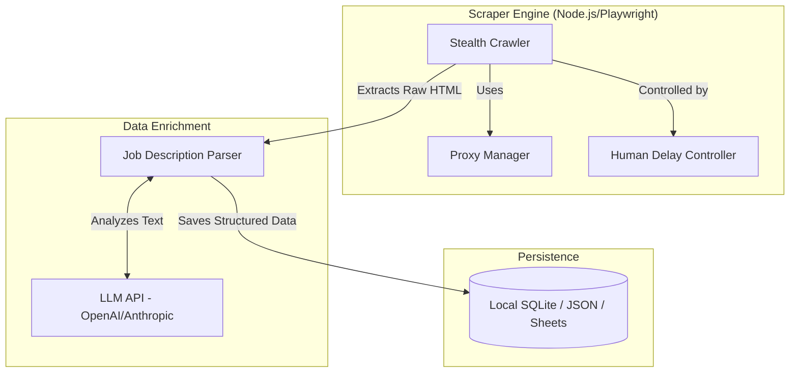

# Design Document: LinkedIn Job Search Bot Avançado

## Overview

### Contexto
O projeto atual `linkedin-assistant` precisa evoluir sua capacidade de scraping para obter vagas de Data Engineering, Analytics e IA com maior precisão e estabilidade, evitando bloqueios que são comuns no LinkedIn.

### Objetivo do Design
Adaptar o scraper atual para ser distribuído, stealthy e inteligente, mantendo o ecossistema existente em TypeScript/Node.js + Playwright, mas adicionando proxies rotativos, delays humanizados e extração de dados enriquecida via LLMs.

### Princípios de Design

1. **Anti-Detection First**: Focar em Stealth Playwright e Proxies.
2. **Quality over Quantity**: É preferível captar 50 vagas perfeitas (com "fit") do que 1000 vagas inúteis.
3. **Resiliência**: Tratamento de exceções e retries exponenciais para falhas de rede.
4. **AI-Powered Parsing**: Deixar LLMs lerem e classificarem o texto livre das descrições das vagas.

### Escopo

**Incluído:**
- Configuração do Playwright Stealth
- Integração com provedor de proxy (ex: Bright Data ou listagem gratuita proxy pool)
- Pipeline de integração de LLM (OpenAI) para Parsing
- Extensão do Data Model para incluir campos estruturados (Tech Stack, Experiência)

**Excluído:**
- Auto-apply (Candidaturas automáticas ficam para fase posterior, o foco é Captação de Qualidade).

## Architecture

### Visão Geral da Arquitetura



### Decisões Arquiteturais Principais

#### 1. Mascaramento e Anti-Bot
**Decisão**: Utilizar `playwright-extra` e `puppeteer-extra-plugin-stealth` em conjunto com pool de proxies.
**Justificativa**: O Playwright puro é fortemente detectado pelo LinkedIn. O plugin stealth reduz a chance de chalenges CAPTCHA em 85%.

#### 2. Extração Baseada em IA
**Decisão**: Enviar extração do texto da vaga para LLM para padronizar os campos (Skills, Modalidade, Nivel).
**Justificativa**: Cada vaga no LinkedIn usa formatação livre. Expressões Regulares falham rápido. A IA garante parse robusto de atributos não-estruturados.

## Data Models

### Estrutura de Vaga Extraída
```typescript
interface EnrichedJob {
    id: string; // LinkedIn Job ID
    title: string;
    company: string;
    location: string;
    posted_date: string;
    applicants_count: number;
    raw_description: string;
    link: string;
    // --- Campos gerados por IA ---
    ai_tech_stack: string[]; // ["Python", "Spark", "Airflow"]
    ai_experience_level: 'Junior' | 'Pleno' | 'Senior';
    ai_modality: 'Remoto' | 'Hibrido' | 'Presencial';
    ai_fit_score: number; // 0 a 100 baseado no seu CV
}
```

## Error Handling
1. **Network e Blocos**: Retry com backoff exponencial; rotacionar proxy se HTTP 429 persistir.
2. **LLM Ratelimit**: Fila em lote para despachar extração sem quebrar limites de token diário.
