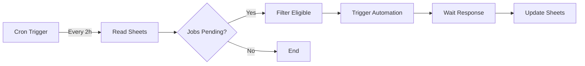

# 🏗️ System Design - LinkedIn Assistant

> **Document:** Arquitetura detalhada do sistema  
> **Phase:** 2 (PLANNING)  
> **Last Updated:** 2026-02-04

---

## 📋 Índice

- [Visão Geral](#visão-geral)
- [Diagrama de Componentes](#diagrama-de-componentes)
- [Fluxo de Dados](#fluxo-de-dados)
- [Componentes Detalhados](#componentes-detalhados)
- [Comunicação entre Componentes](#comunicação-entre-componentes)
- [Escalabilidade](#escalabilidade)

---

## Visão Geral

O LinkedIn Assistant é um sistema distribuído composto por 4 camadas principais:

```
┌─────────────────────────────────────────────────────────────────┐
│                        ORCHESTRATION LAYER                       │
│                              n8n                                 │
│  ┌──────────────┐  ┌──────────────┐  ┌──────────────┐          │
│  │  Scheduler   │  │ Job Collector│  │   Trigger    │          │
│  │   (Cron)     │  │  (Workflow)  │  │  Automation  │          │
│  └──────┬───────┘  └──────┬───────┘  └──────┬───────┘          │
└─────────┼──────────────────┼──────────────────┼─────────────────┘
          │                  │                  │
          ▼                  ▼                  ▼
┌─────────────────────────────────────────────────────────────────┐
│                         DATA LAYER                               │
│                      Google Sheets                               │
│  ┌──────────────────────┐    ┌──────────────────────┐           │
│  │    Aba "Vagas"       │    │  Aba "Candidaturas"  │           │
│  │  - ID, Título, Link  │    │ - ID, Status, Logs   │           │
│  │  - Score, Location   │    │ - Timestamps, Errors │           │
│  └──────────────────────┘    └──────────────────────┘           │
└─────────────────────────────────────────────────────────────────┘
          ▲                                    │
          │                                    ▼
┌─────────────────────────────────────────────────────────────────┐
│                      AUTOMATION LAYER                            │
│                  Node.js/TypeScript Scripts                      │
│  ┌──────────────┐  ┌──────────────┐  ┌──────────────┐          │
│  │  Candidature │  │ Form Detector│  │  RAG Matcher │          │
│  │ Orchestrator │  │   (Dynamic)  │  │  (Jaccard)   │          │
│  └──────┬───────┘  └──────┬───────┘  └──────┬───────┘          │
│         │                  │                  │                  │
│         └──────────────────┴──────────────────┘                  │
│                           │                                      │
│                    ┌──────▼───────┐                             │
│                    │  Browser Mgr │                             │
│                    │  (Playwright) │                             │
│                    └──────┬───────┘                             │
└───────────────────────────┼─────────────────────────────────────┘
                            │
                            ▼
┌─────────────────────────────────────────────────────────────────┐
│                       EXTERNAL LAYER                             │
│                       LinkedIn Website                           │
│  ┌──────────────┐  ┌──────────────┐  ┌──────────────┐          │
│  │    Login     │  │  Job Pages   │  │   Forms      │          │
│  └──────────────┘  └──────────────┘  └──────────────┘          │
└─────────────────────────────────────────────────────────────────┘
```

---

## Diagrama de Componentes

### 1. Orchestration Layer (n8n)



**Responsabilidades:**
- Agendar execuções periódicas
- Ler vagas do Google Sheets
- Filtrar vagas elegíveis (Score > 70, Location = Brasil, Tentativas < 3)
- Chamar scripts Node.js via HTTP/Webhook
- Atualizar resultados no Sheets

**Nodes n8n:**
- `Schedule Trigger`: Cron job
- `Google Sheets`: Read/Write operations
- `Function`: Filtrar vagas
- `HTTP Request`: Chamar automation scripts
- `Error Handling`: Fallback em caso de falha

---

### 2. Data Layer (Google Sheets)

**Aba "Vagas" (Existente - Coletada pelo n8n)**

| Campo | Tipo | Descrição | Exemplo |
|-------|------|-----------|---------|
| ID | String | Unique ID da vaga | `job_12345` |
| Título | String | Título da vaga | "Engenheiro de Dados Sr" |
| Link | URL | Link direto da vaga | `https://linkedin.com/jobs/view/...` |
| Empresa | String | Nome da empresa | "Google Brasil" |
| Localização | String | Local da vaga | "Brasil - Remoto" |
| Score | Number | Score de match (0-100) | 85 |
| Data Coleta | DateTime | Quando foi coletada | `2026-02-04 10:30` |
| Tipo | String | Categoria | "Engenharia de Dados" |

**Aba "Candidaturas" (NOVA - Criada pela automação)**

| Campo | Tipo | Descrição | Exemplo |
|-------|------|-----------|---------|
| ID | String | Unique ID da candidatura | `app_67890` |
| VagaID | String | FK para Aba Vagas | `job_12345` |
| Status | Enum | `pending`, `success`, `failed`, `skipped` | `success` |
| Data Candidatura | DateTime | Timestamp da aplicação | `2026-02-04 14:22` |
| Tentativas | Number | Contador de retries | 1 |
| Fill Rate | Number | % de campos preenchidos | 85 |
| Campos Detectados | Number | Total de campos no form | 12 |
| Campos Preenchidos | Number | Quantos foram preenchidos | 10 |
| RAG Usado | Boolean | Se usou RAG | `true` |
| Erro | String | Mensagem de erro (se failed) | `"Captcha timeout"` |
| Log URL | URL | Link para logs detalhados | S3/Cloud Storage URL |
| Tempo Execução (s) | Number | Duração em segundos | 45 |

---

### 3. Automation Layer (Node.js/TypeScript)

#### 3.1. Componente: Candidature Orchestrator

**Arquivo:** `src/automation/candidature.ts`

**Interface Pública:**
```typescript
interface CandidatureOptions {
  jobId: string;
  jobUrl: string;
  jobTitle: string;
  company: string;
  maxRetries?: number;
}

interface ApplicationResult {
  status: 'success' | 'failed' | 'skipped';
  fillRate: number;
  fieldsDetected: number;
  fieldsFilled: number;
  ragUsed: boolean;
  error?: string;
  executionTime: number;
}

async function applyCandidature(
  options: CandidatureOptions
): Promise<ApplicationResult>
```

**Fluxo Interno:**
1. Inicializa browser (via Browser Manager)
2. Faz login no LinkedIn (se necessário)
3. Navega para URL da vaga
4. Detecta captcha (se presente, aguarda resolução)
5. Clica em botão "Candidatar-se"
6. Chama Form Detector
7. Chama RAG Matcher + Form Filler
8. Decide submeter ou skip (baseado em fill rate)
9. Registra resultado
10. Fecha browser

**Dependências:**
- `browser.ts` (Browser Manager)
- `form-detector.ts` (Form Detector)
- `form-filler.ts` (Form Filler)
- `rag-matcher.ts` (RAG Matcher)
- `handlers/login.ts` (Login Handler)
- `handlers/captcha.ts` (Captcha Detector)

---

#### 3.2. Componente: Form Detector

**Arquivo:** `src/automation/form-detector.ts`

**Responsabilidade:** Detectar dinamicamente campos de formulários do LinkedIn.

**Interface:**
```typescript
interface FormField {
  type: 'text' | 'email' | 'tel' | 'select' | 'textarea' | 'checkbox' | 'radio' | 'date';
  label: string;
  name: string;
  id: string;
  selector: string;
  required: boolean;
  placeholder?: string;
  value?: string;
}

interface FormAnalysis {
  fields: FormField[];
  submitButton: { selector: string; text: string };
  totalFields: number;
  requiredFields: number;
}

async function detectForm(page: Page): Promise<FormAnalysis>
```

**Estratégia de Detecção:**
1. Procurar por `<form>` ou containers com `role="form"`
2. Buscar todos `<input>`, `<select>`, `<textarea>` dentro do form
3. Associar labels usando:
   - `<label for="field-id">`
   - `aria-label` attribute
   - Placeholder text
4. Identificar campos required via:
   - `required` attribute
   - `aria-required="true"`
   - Asterisco (*) no label
5. Detectar botão de submit:
   - `type="submit"`
   - Texto "Enviar", "Submit", "Candidatar"

**Casos Especiais:**
- Multi-step forms (LinkedIn usa modais sequenciais)
- Dynamic fields (aparecem após seleção)
- Autocomplete dropdowns

---

#### 3.3. Componente: RAG Matcher

**Arquivo:** `src/automation/rag-matcher.ts`

**Responsabilidade:** Match de perguntas com respostas na RAG database usando similarity.

**Interface:**
```typescript
interface MatchResult {
  answer: string;
  confidence: number; // 0-1
  questionMatched: string;
}

async function findBestMatch(
  question: string,
  ragDatabase: RAGEntry[]
): Promise<MatchResult | null>
```

**Algoritmo:**
1. Normalizar pergunta (lowercase, remover pontuação)
2. Tokenizar (split em palavras)
3. Calcular Jaccard similarity com cada pergunta na RAG DB:
   ```
   similarity = |A ∩ B| / |A ∪ B|
   ```
   Onde A = tokens da pergunta, B = tokens da pergunta no DB
4. Selecionar match com maior similarity
5. Se similarity > 0.4 → retornar resposta
6. Caso contrário → retornar null (fallback para skip ou manual)

**RAG Database Schema:**
```json
{
  "entries": [
    {
      "id": "q1",
      "question": "Quantos anos de experiência você tem?",
      "answer": "5 anos",
      "tags": ["experiencia", "anos", "seniority"]
    }
  ]
}
```

---

#### 3.4. Componente: Form Filler

**Arquivo:** `src/automation/form-filler.ts`

**Responsabilidade:** Preencher campos com dados reais ou RAG.

**Interface:**
```typescript
interface FillResult {
  fieldsFilled: number;
  fieldsSkipped: number;
  fillRate: number;
}

async function fillForm(
  page: Page,
  fields: FormField[],
  ragDatabase: RAGEntry[]
): Promise<FillResult>
```

**Lógica de Preenchimento:**
1. Para cada campo detectado:
   - Se label contém keywords conhecidos (nome, email, telefone):
     - Preencher com dados reais do config
   - Caso contrário:
     - Chamar RAG Matcher com label
     - Se match encontrado → preencher com resposta RAG
     - Caso contrário → deixar vazio
2. Aplicar delays humanizados:
   - 50-150ms por caractere digitado
   - 0.5-1.5s entre campos
3. Validar campos após preencher (verificar se valor foi aceito)

**Campos com Dados Reais (Hardcoded):**
- Nome: `process.env.USER_NAME`
- Email: `process.env.USER_EMAIL`
- Telefone: `process.env.USER_PHONE`
- LinkedIn: `process.env.LINKEDIN_URL`
- GitHub: `process.env.GITHUB_URL`

---

#### 3.5. Componente: Browser Manager

**Arquivo:** `src/automation/browser.ts`

**Responsabilidade:** Gerenciar ciclo de vida do browser Playwright.

**Features:**
- Anti-detection (remover `navigator.webdriver`)
- User-Agent randomizado
- Cookies persistence (session reuse)
- Headless mode configurável

```typescript
async function launchBrowser(config: AppConfig): Promise<Browser>
async function createContext(browser: Browser): Promise<BrowserContext>
async function createPage(context: BrowserContext): Promise<Page>
async function closeBrowser(): Promise<void>
```

---

#### 3.6. Handlers Especializados

**Login Handler** (`src/automation/handlers/login.ts`)
```typescript
async function handleLogin(page: Page, credentials: Credentials): Promise<void>
```
- Detecta se já está logado (verificar cookie session)
- Se não, preenche email/senha e faz login
- Espera redirect para home
- Salva cookies para próxima execução

**Captcha Detector** (`src/automation/handlers/captcha.ts`)
```typescript
interface CaptchaResult {
  detected: boolean;
  type?: 'recaptcha' | 'hcaptcha' | 'custom';
}

async function detectCaptcha(page: Page): Promise<CaptchaResult>
async function waitForCaptchaSolve(page: Page, timeout: number): Promise<boolean>
```
- Detecta presença de captcha
- Aguarda resolução manual (timeout configurável)
- Retorna erro se não resolvido

---

## Fluxo de Dados

### Fluxo Completo de Candidatura

```
┌─────────────┐
│   n8n Cron  │
│  (Every 2h) │
└──────┬──────┘
       │
       ▼
┌──────────────────────┐
│  Read Google Sheets  │
│  Aba "Vagas"         │
└──────┬───────────────┘
       │
       ▼
┌──────────────────────┐
│  Filter Eligible:    │
│  - Score > 70        │
│  - Location = Brasil │
│  - Tentativas < 3    │
└──────┬───────────────┘
       │
       ▼
┌──────────────────────┐
│  For Each Job:       │
│  Call Automation API │
└──────┬───────────────┘
       │
       ▼
┌───────────────────────────────────────────────┐
│        AUTOMATION LAYER (Node.js)             │
│                                               │
│  1. Launch Browser                            │
│  2. Login (if needed)                         │
│  3. Navigate to Job URL                       │
│  4. Detect Captcha → Wait if present          │
│  5. Click "Candidatar-se"                     │
│  6. Detect Form Fields                        │
│  7. Match Questions with RAG DB               │
│  8. Fill Form (RAG + real data)               │
│  9. Calculate Fill Rate                       │
│  10. If Fill Rate > 50%:                      │
│      - Submit Form                            │
│      - Status = "success"                     │
│  11. Else:                                    │
│      - Skip Submit                            │
│      - Status = "skipped"                     │
│  12. Close Browser                            │
│  13. Return ApplicationResult                 │
└───────────────────┬───────────────────────────┘
                    │
                    ▼
┌──────────────────────────────────────────────┐
│  n8n: Write to Google Sheets                 │
│  Aba "Candidaturas"                          │
│  - ID, VagaID, Status, Fill Rate, etc.       │
└──────────────────────────────────────────────┘
                    │
                    ▼
┌──────────────────────────────────────────────┐
│  n8n: Update Aba "Vagas"                     │
│  - Increment Tentativas                      │
│  - Set Last Attempt Date                     │
└──────────────────────────────────────────────┘
```

---

## Comunicação entre Componentes

### 1. n8n → Automation Scripts

**Protocolo:** HTTP POST (Webhook)

**Endpoint:** `http://localhost:3000/api/candidature/apply`

**Request:**
```json
{
  "jobId": "job_12345",
  "jobUrl": "https://linkedin.com/jobs/view/...",
  "jobTitle": "Engenheiro de Dados Sr",
  "company": "Google Brasil",
  "maxRetries": 3
}
```

**Response:**
```json
{
  "status": "success",
  "fillRate": 85,
  "fieldsDetected": 12,
  "fieldsFilled": 10,
  "ragUsed": true,
  "executionTime": 45
}
```

**Error Response:**
```json
{
  "status": "failed",
  "error": "Captcha timeout exceeded",
  "executionTime": 120
}
```

---

### 2. Automation Scripts → Google Sheets

**Protocolo:** Google Sheets API v4

**Library:** `googleapis` npm package

**Operations:**
- `sheets.spreadsheets.values.append()` - Adicionar nova candidatura
- `sheets.spreadsheets.values.update()` - Atualizar tentativas na aba Vagas
- `sheets.spreadsheets.values.get()` - Ler configurações

**Autenticação:**
- Service Account JSON (via env var `GOOGLE_SERVICE_ACCOUNT`)
- OAuth 2.0 flow (alternativa)

---

### 3. Form Detector → RAG Matcher → Form Filler

**Protocolo:** In-process function calls (mesmo runtime Node.js)

**Sequência:**
```typescript
const formAnalysis = await detectForm(page);
const fillResult = await fillForm(page, formAnalysis.fields, ragDatabase);
```

Internamente, `fillForm` chama `ragMatcher.findBestMatch()` para cada campo.

---

## Escalabilidade

### Vertical Scaling (Single Machine)

**Limitações Atuais:**
- 1 browser instance por execução
- Processamento sequencial de vagas
- n8n single-node

**Otimizações Possíveis:**
1. **Browser Pooling:** Manter 3-5 browsers abertos reutilizáveis
2. **Parallel Jobs:** Processar 2-3 vagas simultaneamente (rate limiting aware)
3. **Persistent Sessions:** Reutilizar cookies/sessions para evitar re-login

**Capacidade Estimada:**
- **Atual:** ~20 candidaturas/hora (3min por candidatura)
- **Otimizado:** ~60 candidaturas/hora (1min por candidatura, 3 parallel)

---

### Horizontal Scaling (Multi-Machine)

**Arquitetura Futura:**

```
┌─────────────┐
│  n8n Queue  │
│  (Redis)    │
└──────┬──────┘
       │
       ├──────────┬──────────┬──────────┐
       ▼          ▼          ▼          ▼
   Worker 1   Worker 2   Worker 3   Worker N
   (Node.js)  (Node.js)  (Node.js)  (Node.js)
       │          │          │          │
       └──────────┴──────────┴──────────┘
                      │
                      ▼
              ┌───────────────┐
              │ Google Sheets │
              └───────────────┘
```

**Componentes Adicionais:**
- **Redis Queue:** Distribuir jobs entre workers
- **Bull/BullMQ:** Job queue library
- **Docker Containers:** 1 container = 1 worker
- **Load Balancer:** Distribuir requests

**Capacidade Estimada:**
- 4 workers × 60 candidaturas/hora = **240 candidaturas/hora**

---

### Rate Limiting & LinkedIn Compliance

**Limites Recomendados:**
- **Max candidaturas/dia:** 50 (configurable em `config/limits.json`)
- **Max candidaturas/hora:** 15
- **Delay entre candidaturas:** 5-15 segundos (randomizado)
- **Max retries por vaga:** 3

**Implementação:**
```typescript
// src/utils/rate-limiter.ts
class RateLimiter {
  private dailyCount = 0;
  private hourlyCount = 0;
  
  async checkLimit(): Promise<boolean> {
    if (this.dailyCount >= config.maxDailyApplications) {
      logger.warn('Daily limit reached');
      return false;
    }
    if (this.hourlyCount >= config.maxHourlyApplications) {
      logger.warn('Hourly limit reached, waiting...');
      await delay(3600000); // Wait 1 hour
    }
    return true;
  }
  
  increment() {
    this.dailyCount++;
    this.hourlyCount++;
  }
}
```

---

## Monitoramento & Observability

### Logs

**Tool:** Pino (JSON structured logging)

**Níveis:**
- `info`: Progresso normal (job started, form detected, submitted)
- `warn`: Situações recuperáveis (fill rate baixo, retry)
- `error`: Erros críticos (captcha timeout, network error)
- `debug`: Detalhes técnicos (selectors, page state)

**Exemplo:**
```json
{
  "level": "info",
  "time": 1643980800000,
  "msg": "Form submitted successfully",
  "jobId": "job_12345",
  "company": "Google Brasil",
  "fillRate": 85,
  "executionTime": 45
}
```

---

### Métricas

**KPIs a rastrear:**
- Taxa de sucesso (% success vs failed vs skipped)
- Fill rate médio
- Tempo médio de execução
- Campos mais comuns não preenchidos (para melhorar RAG DB)
- Frequência de captchas

**Dashboard Futuro:**
- Grafana + Prometheus
- Google Sheets com fórmulas agregadas

---

## Segurança

Veja documento completo em [SECURITY.md](SECURITY.md).

**Resumo:**
- Credenciais via GitHub Secrets + env vars
- Service account Google com permissões mínimas
- Logs nunca expõem credenciais
- Rate limiting para evitar ban
- User-Agent rotation
- Anti-detection techniques

---

## Próximos Passos

1. ✅ Revisar este documento
2. ⬜ Implementar componentes base
3. ⬜ Escrever testes unitários
4. ⬜ Integrar com n8n
5. ⬜ Deploy inicial em staging
6. ⬜ Testar E2E com vagas reais
7. ⬜ Ajustar RAG database baseado em resultados
8. ⬜ Deploy em produção

---

**Status:** ✅ Phase 2 (PLANNING) - In Progress  
**Última Atualização:** 2026-02-04  
**Próximo:** Implementar componentes base (Phase 4)
